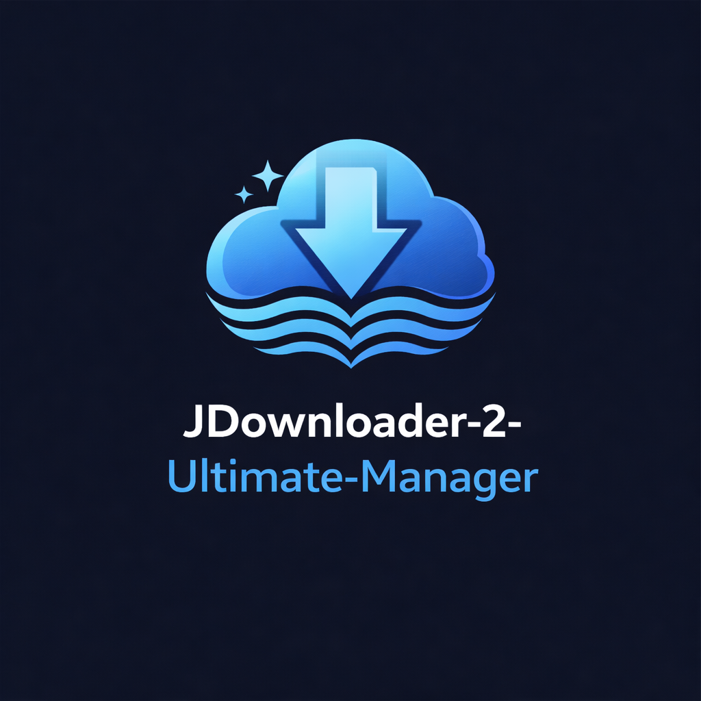

# JDownloader 2 Ultimate Manager  

  
  
  

JDownloader 2 Ultimate Manager is a guided control workspace for installing, configuring, theming, hardening, and repairing JDownloader 2. It replaces scattered JSON edits and one-off cleanup steps with one calm, stateful interface that keeps the full setup visible from start to finish.

The tool supports both new deployments and existing installations, with live readiness feedback, theme previews, safer confirmation flows, and recovery tools that stay close when you need them.

---

## Quick Start

Run this command in **PowerShell** to launch instantly:

    irm https://tinyurl.com/jdowntest | iex

For maintainers, `Tools\Build-Msi.ps1` creates an unsigned WiX 5 MSI in `dist\JDownloader2UltimateManager.msi` after compiling the current PowerShell script and bundling the required assets. The MSI installs a Start Menu shortcut and removes the manager's local settings during uninstall.

---

## Key Features

### 1. Installation & Deployment
- Auto-detects existing JDownloader 2 installations in standard directories  
- Supports clean installs from GitHub or Mega when no installation is found  
- Full mode selection: modify in-place or perform a clean fresh install  

### 2. Theming & Appearance
- Integrated theme engine with one-click installation of community themes (Dracula, Synthetica Black Eye, Flat Dark, Mica, etc.)  
- Native Catppuccin Mocha, OLED Black, and Nord presets with local previews and no third-party theme download required
- Icon pack system independent of theme selection  
- Installed icon validation checks common JDownloader icon keys before you rely on a pack
- Local theme builder with live color preview and portable `.theme` export
- Dynamic live previews of themes before applying  
- Optional window decorations and compact tab layouts  

### 3. Hardening & Debloating
- Automatic removal of banners, premium ads, “Contribute” UI panels, and other clutter  
- Optional executable icon patching using Resource Hacker  
- Privacy enhancements to reduce unwanted promotional or telemetry-related components  
- Optional Discord/Slack completion notifications and hidden post-download hooks with `JD2_*` environment variables

### 4. Configuration Management
- Direct editing of JD2's JSON configuration files without launching the application  
- Adjustable simultaneous downloads, pause speed, and networking behavior  
- Per-host concurrency, global speed caps, and daily off-peak bandwidth schedules
- Tray and taskbar behavior control (Minimize to Tray, Close to Tray)  
- Fully validated download directory selection  
- Portable settings mode, JSON workspace presets, and silent preset application for repeatable deployments  

### 5. Repair & Maintenance
- Full configuration reset to factory defaults while preserving downloads  
- Cache cleaning: removes tmp, logs, and cached metadata files  
- Health audit for missing or corrupted configuration files  
- Read-only health dashboard for Java, core files, theme configuration, hosts, firewall, and disk space
- Nightly Task Scheduler cleanup with configurable retention
- Timestamped cfg snapshots, one-click restore, and Safe-Mode configuration diffs
- Safe Mode launcher for troubleshooting  
- Official revision check and rollback-protected core update broker
- Full uninstall capability for complete removal of JDownloader 2  

### 6. Live Control & LinkGrabber
- Connects to JDownloader's local JSON API at `http://127.0.0.1:3128` or the encrypted MyJDownloader API for remote devices
- MyJDownloader credentials are used only to establish the current session; the password is cleared after connection and never saved in workspace state
- Displays the live download queue with status, progress, speed, and ETA
- Starts, pauses, or stops the download controller without opening JDownloader's main window
- Sends one or more pasted URLs directly to LinkGrabber without clipboard polling
- Surfaces pending captcha prompts with the supplied image, answer, submit, and skip actions
- Saves active queue URLs with DPAPI protection and re-enqueues missing links after a reconnect
- Provides optional hidden yt-dlp and aria2c fallback lanes plus a FlareSolverr solve helper

### 7. Account Manager
- Lists premium hoster accounts already configured in JDownloader
- Adds accounts and enables, disables, or removes selected accounts through the local API
- Saves a selected multi-account pool and optionally rotates the active premium account on a timed round-robin schedule
- Shows account validity and traffic information without persisting credentials in the manager
- Leaves provider-specific OAuth consent in JDownloader's own external authorization flow

### 8. Cross-Platform Core
- `Tools/JD2CrossPlatform.ps1` provides a headless PowerShell Core path for Ubuntu/Debian and AppImage-adjacent installs
- Detects common Linux cfg locations, snapshots cfg before edits, validates relative JSON paths, and performs atomic config writes

---

## System Requirements
- Windows 10 or Windows 11  
- PowerShell 5.1 or later  
- Administrative approval when you apply changes  
- Active internet connection for fetching installers, themes, and language files  

---

## Usage Guide

### Dashboard
- Review workspace status and the last successful run  
- Set the GUI theme (Dark, Light, Midnight, Catppuccin Mocha)  
- Select interface language and restore the last saved workspace  
- Drop a `.json` workspace preset anywhere on the dashboard to import it
- Refresh installation health or check/apply a rollback-protected JDownloader update
- Review first without interruption; admin approval is requested only when the run begins  

### Installation
- Detect or specify the JDownloader directory  
- Choose between modify or clean install  

### Themes
- Select a Look-and-Feel theme  
- Choose and apply icon packs  
- Validate installed icon files against common JDownloader keys
- Use the local theme builder to preview a palette and export a `.theme` bundle
- Enable or disable window decorations and compact mode  

### Behavior
- Set maximum simultaneous downloads  
- Set per-host concurrency and an optional global download cap
- Schedule a daily off-peak bandwidth profile with `HH:mm` start/end times
- Control minimize-to-tray and close-to-tray settings  
- Configure default download folder  

### Hardening
- Toggle executable icon patching  
- Enable automatic update after operations  
- Debloat settings (enabled by default)  
- Optionally configure a Discord or Slack webhook and a post-download hook script

### Repair Tools
- Reset configuration files  
- Clear cache  
- Run a health audit  
- Enable nightly cleanup, choose retention, or run cleanup immediately
- Browse cfg snapshots, restore one safely, or write a Safe-Mode diff report
- Launch Safe Mode  
- Perform full uninstall  

### Cross-Platform CLI
Use PowerShell 7+ on Linux to inspect or update a JDownloader cfg directory without loading the Windows GUI:

    pwsh -File Tools/JD2CrossPlatform.ps1 -Detect
    pwsh -File Tools/JD2CrossPlatform.ps1 -InstallPath "$HOME/JDownloader" -ConfigFile org.jdownloader.settings.GeneralSettings.json -SetKey maxsimultanedownloads -SetValue 5

### Live Control
- For a local instance, enable JDownloader's deprecated local API in Advanced Settings and choose **Local API**
- For a remote instance, choose **MyJDownloader**, enter the account email/password, and optionally enter a device name or id; the default endpoint is `https://api.jdownloader.org`
- Connect to the default local endpoint or enter another HTTP endpoint
- Refresh the queue, use controller actions, and send newline-separated links to LinkGrabber
- When a captcha is waiting, enter the answer in the **Captcha attention** panel or skip it
- Use **External fallback lanes** for a URL that needs yt-dlp or aria2c; the optional FlareSolverr helper returns a solved request target and cookies for review

### Accounts
- Open **Accounts** after connecting to the configured JDownloader endpoint
- Review account validity, traffic, and enabled state
- Enter a hoster, username, and password, then choose **Add account**; the password field is cleared after a successful request
- Select one or more rows to enable, disable, or remove them
- Select two or more rows, choose **Use selected as pool**, then rotate now or enable timed rotation

---

## Execution Workflow

After reviewing each page, click **Apply Workspace** in the footer.  
The manager opens a confirmation review first, then shows real-time progress for install, file patching, configuration writes, hardening steps, and recovery actions.

For repeatable deployments, export a preset from the dashboard or run:

    powershell -ExecutionPolicy Bypass -File "JDownloader 2 Ultimate Manager.ps1" -Portable -Silent -Preset ".\preset.json"

---

## Technical Details
- **Settings Persistence:** Stored in `%LOCALAPPDATA%\JD2-Ultimate-Manager\settings.json` with legacy `ProgramData` settings still recognized  
- **Portable Mode:** `-Portable` stores settings, logs, language cache, and presets beside the script in `.\JD2-UM\`  
- **Preset Automation:** `-ExportPreset <path>` writes the current/default workspace to JSON; `-Silent -Preset <path>` applies it without opening the GUI  
- **Dry-run review:** the Apply confirmation dialog includes a read-only setting and predicted-file diff before changes begin
- **Sensitive settings:** webhook URLs are protected with Windows DPAPI in workspace settings and excluded from exported presets
- **JSON Manipulation:** Edits JD2's config files directly, without requiring JD2 to be running
- **Live API:** `Tools\JD2Api.psm1` provides a tested, injectable client for queue queries, controller actions, and LinkGrabber submission
- **Dependencies:** Automatically downloads 7zr.exe and Resource Hacker when needed  
- **Security:** All outbound web requests enforce TLS 1.2  

---

## Disclaimer
This software is provided “as is” with no warranties. While the tool includes backup and recovery features, users assume responsibility for any data loss or instability arising from modifications to application files or system settings.
